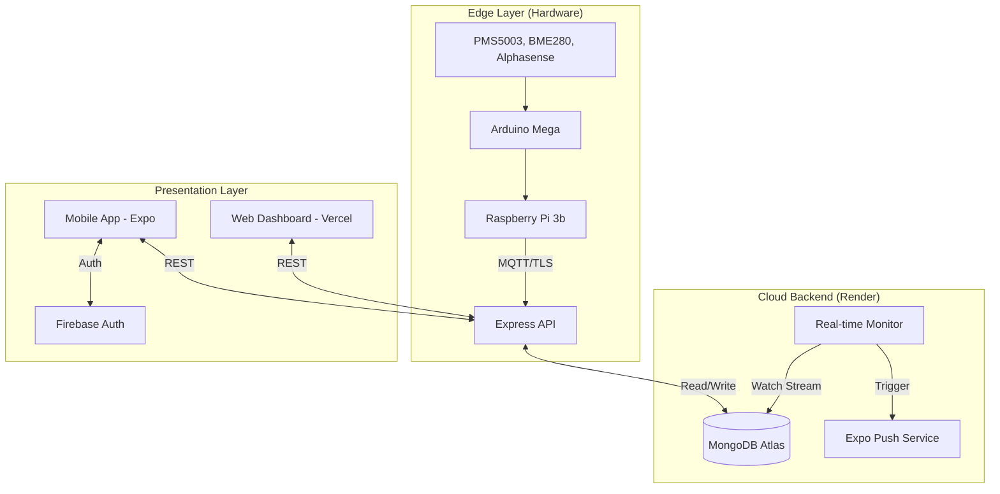

# Udara - Air Quality Monitoring System

**Udara** ("Air" in Malay) is a comprehensive IoT-based Air Quality Monitoring system designed for both real-time public awareness and environmental research. It features a React Native mobile app, a persistent Node.js backend, and a custom-built hardware sensor array.

## 🚀 Project Overview

The system provides:
*   **Real-time Monitoring:** Tracking PM2.5, PM10, CO2, NO2, SO2, Temperature, and Humidity.
*   **Instant Alerts:** Sub-second latency push notifications triggered by hazardous air quality levels.
*   **Research Tools:** Historical data logging (MongoDB) and simulation scripts for behavioral studies.
*   **Multi-Platform Access:** Native Mobile App (iOS/Android) and Web Dashboard.

---

## 🏗️ System Architecture

---

## 🛠 Tech Stack

### **Frontend & Mobile**
*   **Mobile:** React Native (Expo SDK 53) with Native Google Sign-In.
*   **Web:** Next.js (Vercel).
*   **Routing:** Expo Router v5.
*   **Persistence:** AsyncStorage & MMKV.

### **Backend & Data**
*   **Runtime:** Node.js (Render - Persistent Instance).
*   **Database:** MongoDB Atlas (Replica Set for Change Streams).
*   **Push Service:** `expo-server-sdk`.

### **Hardware**
*   **Controller:** Raspberry Pi 3b + Arduino Mega.
*   **Power:** Geekworm X728 UPS.
*   **Sensors:** Alphasense 4-way AFE (CO, SO2, NO2, O3), PMS5003, BME280.

---

## ⚙️ Setup & Installation

### 1. Backend Setup (Render/Local)
1.  `cd backend`
2.  `npm install`
3.  Configure `.env` with `MONGODB_URI` and `PORT`.
4.  `npm run dev` (Local) or deploy to Render.

### 2. Frontend Setup (Expo)
1.  `npm install`
2.  Configure `.env` with `EXPO_PUBLIC_API_URL` and Firebase credentials.
3.  **Development Build:** Native modules (Google Sign-In) require a native build.
    *   `npx expo run:android` or `npx expo run:ios`.

---

## 📡 Key Endpoints & Links

| Service | URL / Endpoint |
| :--- | :--- |
| **Backend API** | `https://udara.onrender.com` |
| **Web Dashboard** | `https://udara-frontend.vercel.app/` |
| **Mobile Build** | [Expo Build Link](https://expo.dev/accounts/4peng/projects/Udara/builds/cfa116ac-a719-4282-b1ee-81c6d1731a3a) |
| **Health Check** | `GET /health` |

---

## 📊 Research & Data Analysis
*   **Data Export:** Data is stored in MongoDB Atlas (`sensor_data_readings`).
*   **Simulation:** Use `node backend/scripts/simulateBadAir.js` to trigger alerts for testing user response.
*   **Thresholds:** PM2.5 (Hazardous > 35.4), PM10 (Hazardous > 154).

